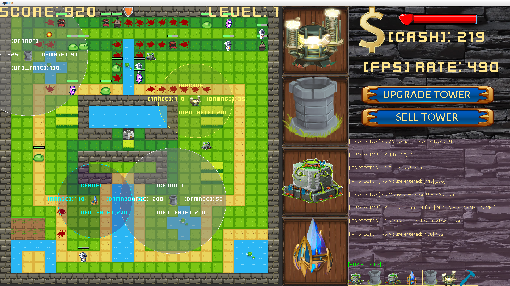
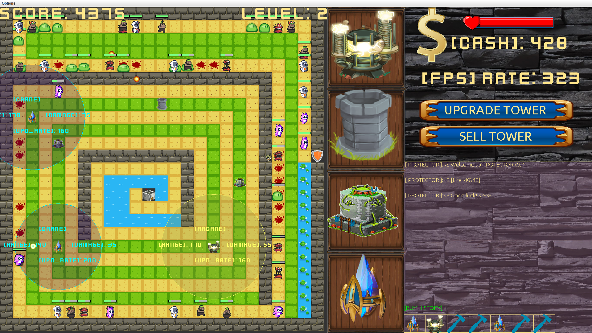
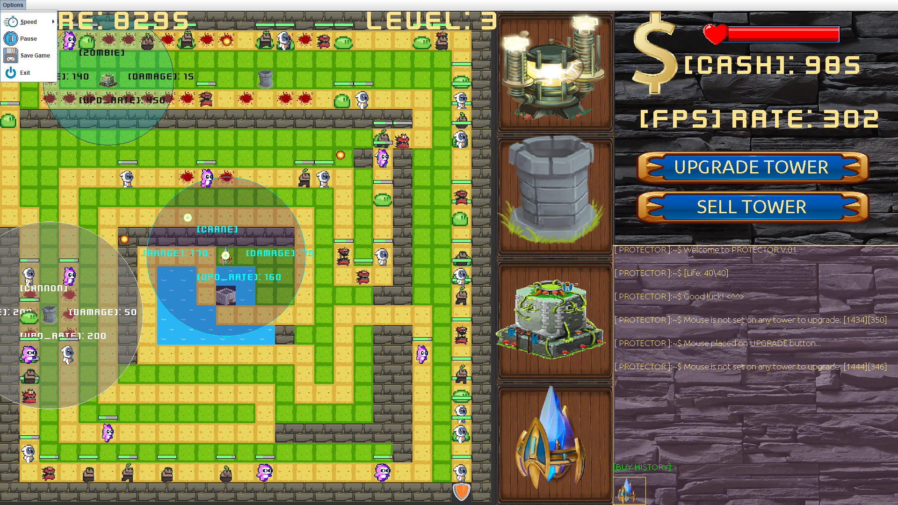
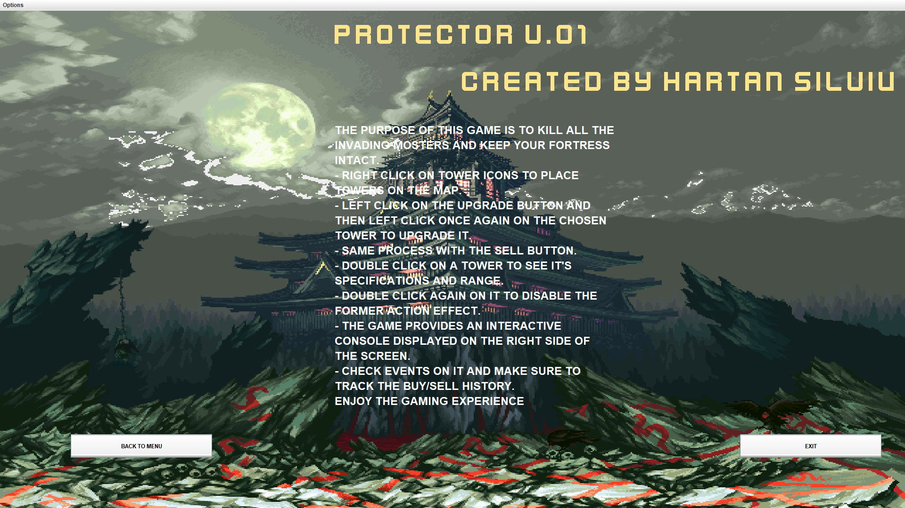
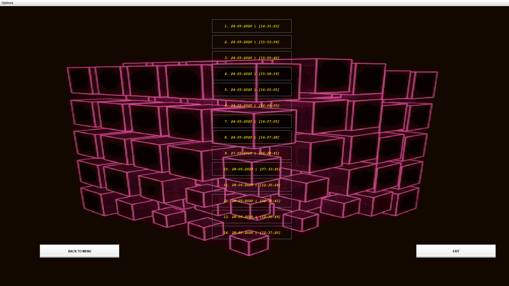
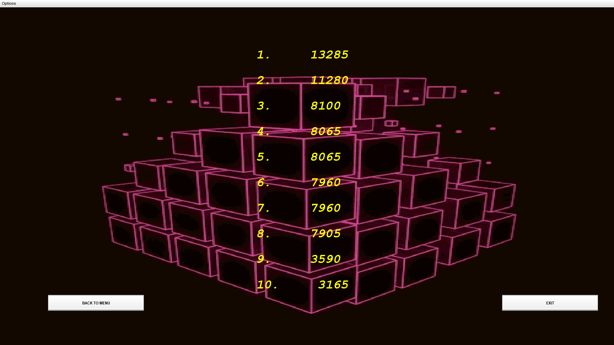

# Protector V.01 :milky_way:

**Protector**  is a  *Tower Defence* game where the goal is to defend the player's territory by obstructing the enemy attackers, achieved by placing defensive structures  along their path of attack. Strategic choice and positioning of defensive elements is an essential strategy of the genre.


## Setup :computer:
(*The machine needs to have jre and jdk installed. The project runs on latest version of java.*)
* ### Installation 
	* Install java on Windows: [link](https://www.java.com/en/download/help/windows_manual_download.xml)
	*  Install java on Ubuntu and Linux Mint: 
		```bash
		     sudo apt install default-jre
		     sudo apt install default-jdk
		     sudo apt install oracle-java14-installer
		     sudo apt install oracle-java14-set-default
	```
* ### Clone 
	* Clone link: [clone](https://github.com/silviuh/Protector_V.01.git) 

##  Gameplay :boom:
The basic gameplay elements of this game are:
-   territories, possessions, domiciles, loved ones (or collectively the "base") that must be defended by the player.
-   waves of multiple incoming "enemies" that must be defended against
-   placement of "tower" elements, such as towers, or obstructions along the path of attacking enemies.
What distinguishes this game from other base defending games (such as Space Invaders, or other games where bases are defended) is the player's ability to strategically place, construct, upgrade or summon obstructive constructions and constructive obstructions in the path of attacking enemies.

In a tower defense, unlike the base, the player's main character is often invincible, as the primary object is the survival of the base rather than the player.

**Some features of this game:**
-   Player placed obstructions that can damage or kill enemy attackers before the obstructions destroy the base
-   Ability to sell obstructions
-   Ability to upgrade obstructions
- There are four type of defensive buildings in total.
-   Some sort of currency with which to purchase upgrades and repairs  are in-game money, and it is being earned by the defeat of an attacking.
-   Enemies capable of traversing multiple paths at once
-   Each wave has a set number and types of enemies
- There are four types of hostile enemies that may attack your base. 
- There are three different levels in this game, each one being increased in difficulty. 



---

---


##  Usage :question:
-   The game provides a help menu.


---
-   The game also comes with a save-game option and a load-game menu.

- 
---
-  You may also visualize the highscores in the leaderboards menu.

- 
---

##  Documentation:bookmark_tabs:
[Doxygen documentation](Documentation/html/index.htmll)
(documentation is generated via Doxygen)
